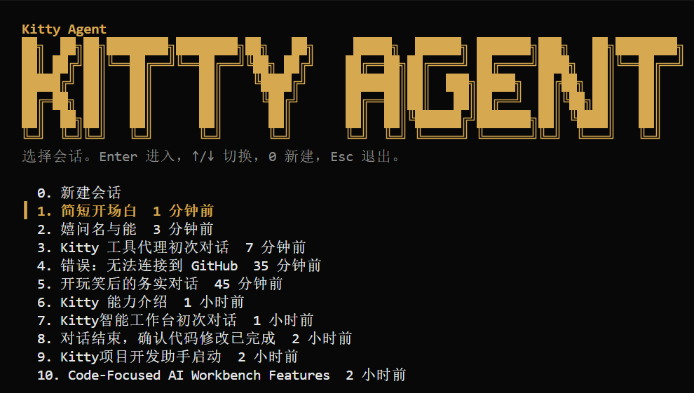
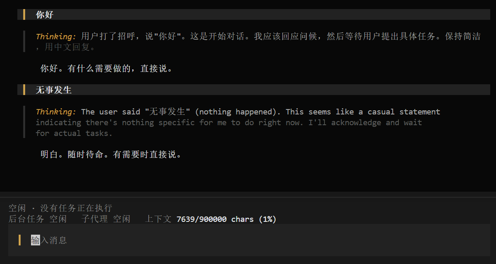

# 小猫智能体 Kitty



官网：https://agentjz.github.io/kitty/

<p align="center">
  <strong>🐾 一个本地 agent 编程工作台：搜得到，看得懂，改得准，跑得通，记得住，能继续。</strong>
</p>

<p align="center">
  <a href="https://www.npmjs.com/package/@jun133/kitty"></a>
  
  
  
  
</p>




小猫智能体是给本地代码仓库使用的 agent harness。

它把本地对话、任务现场、恢复能力和验证事实收进一个稳定的编程工作台，让长任务可以继续，失败可以看见，现场可以审阅。

## ✨ 你能得到什么

- 本地 agent 交互
- 可恢复的 session 现场
- CLI、TUI、Telegram 三种入口
- 当前现场、后台任务、会话事件、memory 和 eval
- 省 token 的上下文与输出治理

## ⚡ 快速开始

安装依赖并构建：

```bash
npm.cmd install
npm.cmd run build
```

初始化当前项目：

```bash
kitty init
```

启动交互式 agent：

```bash
kitty
```

如果已有会话，`kitty` 会先显示最近会话列表：输入 `1` 继续最近会话，输入 `0` 新建会话。没有历史会话时会直接新建。会话标题由模型在第一次真实对话完成后生成，后续保持稳定。

启动 Ink TUI：

```bash
kitty tui
node dist/cli.js tui
```

TUI 是可替换的终端壳层，复用同一套 session、driver、工具和斜杠命令。主区显示用户输入、thinking 和回复；工具、后台任务、subagent 和上下文占用在底部现场区呈现，不灌进主对话区。按键：`Enter` 发送，`Ctrl+J` 换行，`PageUp` / `PageDown` 滚动，`Home` / `End` 跳到顶部 / 底部，鼠标滚轮滚动，`Ctrl+C` 中断当前轮。

交互模式支持本地斜杠命令。斜杠命令直接读取本地现场，不发送给模型：

| 斜杠命令 | 用途 |
| --- | --- |
| `/help` | 查看当前可用斜杠命令 |
| `/status` | 查看当前项目现场 |
| `/background`、`/bg` | 查看后台任务现场 |
| `/memory` | 查看 runtime memory assets |
| `/skills` | 查看 runtime skills 健康状态 |
| `/events` | 查看当前 session 最近事件 |
| `/doctor` | 运行本地配置 preflight |
| `/sessions` | 查看最近会话 |
| `/session` | 查看当前 session id |
| `/copy` | 打印当前 session 对话文本 |
| `/export` | 打印当前 session JSON 快照 |
| `/clear` | 清空 UI shell 的当前输入语义 |
| `/reset` | 清空当前项目运行状态并退出 |
| `/exit`、`quit`、`q` | 退出当前会话 |

执行一次明确任务：

```bash
kitty "检查这个仓库并修复失败测试"
```

## ⌨️ 常用命令

| 命令 | 用途 |
| --- | --- |
| `kitty` | 进入默认 agent 交互；有历史会话时先选择继续或新建，也可直接接收一次性 prompt |
| `kitty agent` | 显式进入 agent 模式 |
| `kitty tui` | 进入 Ink 终端工作台，支持主区滚动、底部输入和运行现场 |
| `kitty background` | 查看后台任务；`wait <id>` 等待任务；`stop <id>` 停止任务 |
| `kitty resume [sessionId]` | 恢复最近会话或指定会话 |
| `kitty sessions` | 查看最近会话 |
| `kitty events [sessionId]` | 查看最近会话或指定会话的机器事件 |
| `kitty config show` | 查看从 `.kitty/.env` 解析出的当前运行配置 |
| `kitty config path` | 查看当前项目 `.kitty/.env` 路径 |
| `kitty status` | 查看当前项目现场：当前目标、下一步、阻塞、后台、恢复、成本、session、context budget、memory、skills、project map、execution、wake |
| `kitty memory` | 创建、查看、读取、搜索、删除 runtime memory assets，或把 memory 沉淀到 skill references |
| `kitty changes` | 查看记录的文件变更 |
| `kitty undo [changeId]` | 撤销最近一次或指定变更 |
| `kitty diff [path]` | 查看当前 git diff |
| `kitty doctor` | 检查 `.kitty` 文件、env contract、provider preset、runtime、provider 连接和下一步 |
| `kitty eval` | 查看产品验收场景；`kitty eval --run` 运行本地机器验收 |
| `kitty telegram serve` | 启动 Telegram 私聊服务 |

查看配置：

```bash
kitty config show
```

扩展开关在 `.kitty/.env` 的 `KITTY_EXTENSION_*` 中维护。

## ⚙️ 配置

项目运行配置只从 `.kitty/.env` 读取。初始化后按 `.kitty/.env` 填写当前启用的 provider、模型、API key 和 profile。

`kitty init` 创建 `.kitty/.env`、`.kitty/.env.example` 和 `.kitty/.kittyignore`，并输出本地配置 preflight 和下一步。`kitty doctor` 先检查这些本地事实，再加载 runtime，最后在 API key 存在时探测 provider 连接；失败时说明该补什么，成功时说明可以启动 Kitty。

`.kitty/.env` 放当前启用的 provider 和 API key，同时保留 YLS、TTAPI、DeepSeek 三组 provider preset 注释块，方便直接切换。Telegram、扩展开关和运行时配置也在 `.kitty/.env` 与 `.kitty/.env.example` 中保持同一结构。

当前支持的主要环境配置包括：

- `KITTY_PROVIDER`
- `KITTY_BASE_URL`
- `KITTY_MODEL`
- `KITTY_API_KEY`
- `KITTY_PROFILE`
- `KITTY_REASONING_EFFORT`
- `KITTY_MAX_OUTPUT_TOKENS`
- `KITTY_TELEGRAM_TOKEN`
- `KITTY_TELEGRAM_ALLOWED_USER_IDS`
- `KITTY_TELEGRAM_PROXY_URL`
- `KITTY_TELEGRAM_API_BASE_URL`

## 📜 文档

- `AGENTS.md`
- `spec/`
- `.codex/skills/kitty-agent-development/SKILL.md`

项目文档、代码和测试共同描述同一个当前现实。

