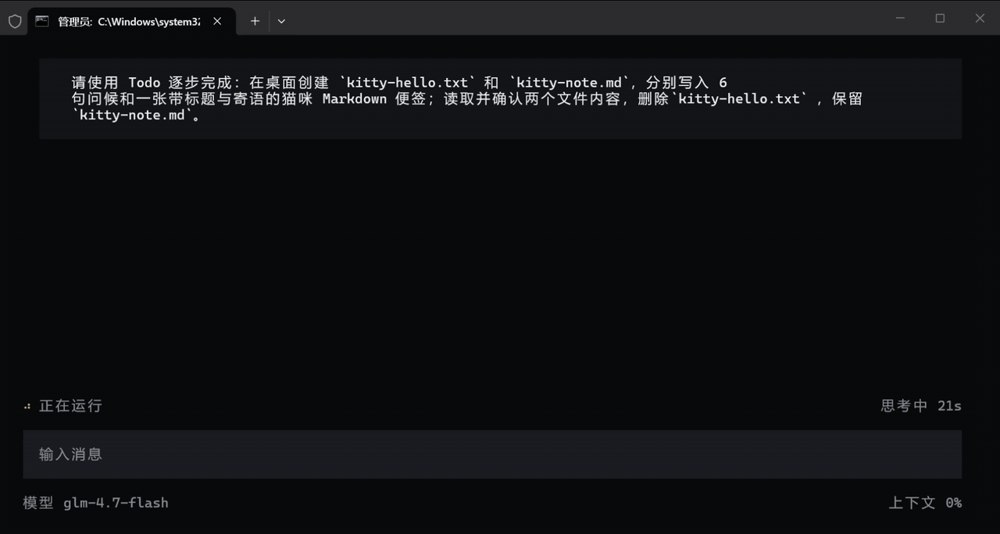

# Kitty Agent

### 如何设计一个智能体

从工具循环开始，理解目标、使用工具、持续行动，完成任务。

[官网](https://luckymaomi.github.io/kitty/) · [快速开始](docs/quickstart.md) · [技术规格](spec.md) · [开发规则](AGENTS.md)

  
  
  
  
  

## 一个模型，如何成为真正的智能体？

模型很会思考，也很会表达，但仅仅拥有一个聊天框，它仍然只能给出答案。

真正的智能体需要看见外部世界，需要采取行动，需要记住已经发生的事情，也需要在漫长、复杂甚至随时可能中断的任务中继续向前。

Kitty 展示了这个过程：没有夸张的炫技。从最简单的工具循环开始，一步一步为模型装上行动、记忆、上下文、计划、后台执行和恢复能力，最终组装成一个能够持续完成任务的智能体。

## 永久免费

Kitty 会持续寻找并加入具有免费层的大模型。具体可用地区、RPM、TPM、RPD、模型权限和免费政策由 Provider 的账号与项目决定，并可能随时变化。

## 常用入口

| 命令 | 用途 |
| --- | --- |
| `kitty` | 启动 Kitty |
| `kitty start` | 初始化项目并打开本地工作台与 Kitty Web |
| `kitty run <prompt>` | 执行一次明确任务 |
| `kitty resume [sessionId]` | 恢复最近或指定会话 |
| `kitty status` | 查看当前运行现场 |
| `kitty background` | 查看或控制后台执行 |
| `kitty telegram serve` | 启动 Telegram 私聊服务 |
| `kitty weixin login` | 扫码登录微信 iLink |
| `kitty weixin serve` | 启动微信私聊服务 |
| `kitty weixin logout` | 清除微信 iLink 登录状态 |
| `kitty --version` | 查看版本 |

在 TUI 输入 `/` 可以查看 `/status`、`/export`、`/stop`、`/new` 和 `/exit`；空输入时按 `?` 可以查看键位。

支持中文、英文、日文和韩文四种语言。

## 本地工作台与能力

`kitty start` 同时完成项目初始化并打开本地工作台：首页保留首次欢迎交互，把 Kitty 网页端、模型设置、工具与扩展、Skill 管理、图片与视频、微信、Telegram 和其他设置作为互相独立的模块入口。工具与扩展页显示内置工具、基础 Web 与 Playwright MCP 的真实状态、用途和工具目录；内部仍由统一能力管理器负责发现、配置、启停、健康和生命周期。基础文件与命令默认启用，也可以整体关闭，让当前轮次只与语言模型交流。

内置工具只读展示，不能在页面新建。Skill 管理只操作当前工作目录 `skills/` 树内的 `SKILL.md` 内容包，支持创建、查看、修改和删除，正文与资源始终按需加载；仓库当前只提供 `read-only` 只读审计 Skill。Playwright 是当前唯一外部 MCP，浏览器运行方式、后台开关和单次操作超时统一位于“其他设置”；默认显示浏览器窗口，用户开启后台运行后才使用无头模式。基础 Web 无需凭证并默认启用：`web_search` 搜索网页，`web_fetch` 有界读取 HTTP(S) 页面，`web_download` 原子下载文件；来源、响应和文件都留下可恢复证据。Bing RSS 的上游使用限制与稳定性风险见 [当前技术事实](spec.md)。

## 继续了解

- [官网：Kitty Agent](https://luckymaomi.github.io/kitty/)
- [小白快速启动](docs/quickstart.md)
- [当前技术事实](spec.md)
- [设计哲学](philosophy.md)
- [开发规则](AGENTS.md)

## 联系我

QQ：1773384983

Wechat：yes_smile_peace

  
微信二维码

  

## License

[MIT](LICENSE)
